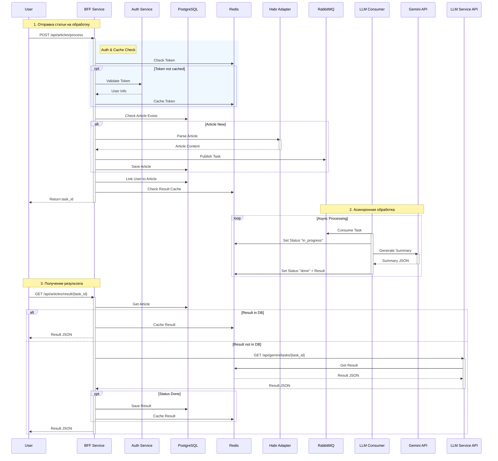

# HabrParserAI

Микросервисная архитектура для парсинга статей с Habr и их обработки с помощью LLM

## Основные возможности

- **BFF Service** - Backend for Frontend, точка входа для клиентов
- **Auth Service** - Сервис аутентификации и авторизации пользователей
- **Habr Adapter** - Сервис для парсинга и получения контента статей
- **LLM Service** - Сервис интеграции с LLM (Gemini) для анализа текста
- **Async Processing** - Асинхронная обработка задач через RabbitMQ
- **Infrastructure** - Полный стек с PostgreSQL, Redis и RabbitMQ в Docker

## Установка и запуск

1. Создать файл `.env` на основе `.env.example`:
```bash
cp .env.example .env
```

2. Запустить проект через Docker Compose:
```bash
docker-compose up -d --build
```

Сервисы будут доступны по адресам:
- BFF Service: http://localhost:8000
- Auth Service: http://localhost:5002
- Habr Adapter: http://localhost:5000
- LLM Service: http://localhost:5001
- RabbitMQ UI: http://localhost:15672 (user/password)

## Структура проекта

```
bff/                # Backend for Frontend сервис
auth_service/       # Сервис аутентификации
habr_adapter/       # Сервис парсинга Habr
llm_service/        # Сервис работы с LLM
docker-compose.yaml # Оркестрация контейнеров
logs/               # Логи приложений
```

## Схема взаимодействия сервисов



## Пример использования

### 1. Регистрация пользователя

```bash
curl -X 'POST' \
  'http://localhost:8000/auth/register/' \
  -H 'accept: application/json' \
  -H 'Content-Type: application/json' \
  -d '{
  "phone_number": "79991234567",
  "password": "strongpassword123",
  "first_name": "Ivan",
  "last_name": "Ivanov"
}'
```

### 2. Авторизация (получение cookie)

```bash
curl -X 'POST' \
  'http://localhost:8000/auth/login/' \
  -H 'accept: application/json' \
  -H 'Content-Type: application/json' \
  -d '{
  "phone_number": "79991234567",
  "password": "strongpassword123"
}' \
  -c cookies.txt
```

### 3. Отправка статьи на обработку

```bash
curl -X 'POST' \
  'http://localhost:8000/api/articles/process' \
  -H 'accept: application/json' \
  -H 'Content-Type: application/json' \
  -b cookies.txt \
  -d '{
  "url": "https://habr.com/ru/companies/selectel/articles/967092"
}'
```

Response:
```json
{
  "task_id": "e79e4b7d-5465-4bc4-b568-fdcd584aecd7",
  "status": "queued"
}
```

### 4. Получение результата

```bash
curl -X 'GET' \
  'http://localhost:8000/api/articles/result/e79e4b7d-5465-4bc4-b568-fdcd584aecd7' \
  -H 'accept: application/json' \
  -b cookies.txt
```

Response:
```json
{
  "status": "done",
  "summary": {
    "title": "Как работают ИИ-агенты...",
    "tldr": "Статья объясняет...",
    ...
  }
}
```