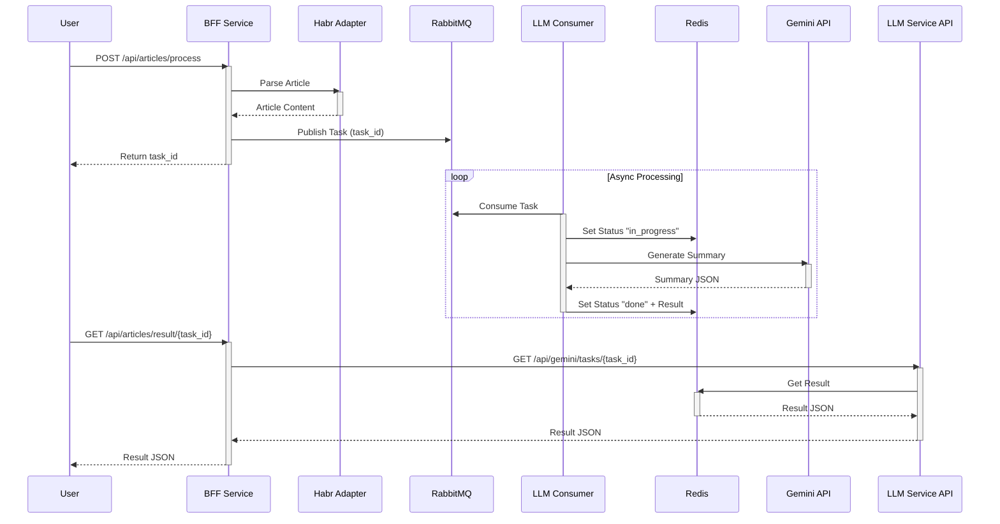

# HabrParserAI

Микросервисная архитектура для парсинга статей с Habr и их обработки с помощью LLM

## Основные возможности

- **BFF Service** - Backend for Frontend, точка входа для клиентов
- **Habr Adapter** - Сервис для парсинга и получения контента статей
- **LLM Service** - Сервис интеграции с LLM (Gemini) для анализа текста
- **Async Processing** - Асинхронная обработка задач через RabbitMQ
- **Infrastructure** - Полный стек с PostgreSQL, Redis и RabbitMQ в Docker

## Установка и запуск

1. Создать файл `.env` на основе `.env.example`:
```bash
cp .env.example .env
```

2. Запустить проект через Docker Compose:
```bash
docker-compose up -d --build
```

Сервисы будут доступны по адресам:
- BFF Service: http://localhost:8000
- Habr Adapter: http://localhost:5000
- LLM Service: http://localhost:5001
- RabbitMQ UI: http://localhost:15672 (user/password)

## Структура проекта

```
bff/                # Backend for Frontend сервис
habr_adapter/       # Сервис парсинга Habr
llm_service/        # Сервис работы с LLM
docker-compose.yaml # Оркестрация контейнеров
logs/               # Логи приложений
```

## Схема взаимодействия сервисов



## Пример результата

Request:
```
curl -X 'POST' \
  'http://localhost:8000/api/articles/process' \
  -H 'accept: application/json' \
  -H 'Content-Type: application/json' \
  -d '{
  "url": "https://habr.com/ru/companies/selectel/articles/967092"
}'
```
Response:
```
{
  "task_id": "e79e4b7d-5465-4bc4-b568-fdcd584aecd7",
  "status": "queued"
}
```

Request:
```
curl -X 'GET' \
  'http://localhost:8000/api/articles/result/e79e4b7d-5465-4bc4-b568-fdcd584aecd7' \
  -H 'accept: application/json'
```

Response
```
{
  "status": "done",
  "summary": {
    "title": "Как работают ИИ-агенты и кому они на самом деле нужны: глубокий обзор и практический гайд",
    "article_type": "Мнение / Аналитика",
    "difficulty": "Средний уровень",
    "tldr": "Статья объясняет, как ИИ-агенты, способные планировать и действовать, отличаются от обычных LLM и чат-ботов. Рассматриваются их типы (workflow, автономные) и сферы применения в бизнесе (HR, документооборот, разработка). Подчеркивается важность подхода RAG для предотвращения галлюцинаций и даются рекомендации по оценке готовности компании и расчету ROI при внедрении ИИ-агентов, ориентируя на долгосрочную стратегию.",
    "stack": {
      "languages": [],
      "tools": [
        "LLM",
        "ChatGPT",
        "API",
        "ERP",
        "CRM",
        "RAG",
        "Databases"
      ]
    },
    "main_points": [
      {
        "headline": "Эволюция и определение ИИ-агентов",
        "explanation": "ИИ-агенты представляют собой следующий шаг после базовых LLM, добавляя способность использовать инструменты, стратегически планировать и координировать действия в мультиагентных системах, что позволяет им самостоятельно решать комплексные задачи, в отличие от простых чат-ботов.",
        "relevance_score": 9
      },
      {
        "headline": "Два основных типа агентов",
        "explanation": "Различаются Workflow-агенты, действующие строго по заданному сценарию для надежности в бизнес-процессах (например, маршрутизация писем), и автономные агенты, которые гибко планируют действия для достижения цели, но несут более высокие риски и требуют толерантности к ошибкам.",
        "relevance_score": 8
      },
      {
        "headline": "Ключевые бизнес-применения ИИ-агентов",
        "explanation": "ИИ-агенты наиболее эффективны в рутинных, объемных и хорошо формализованных процессах. Они приносят ощутимую выгоду в HR (скоринг кандидатов), документообороте (извлечение данных), разработке ПО (код-ревью, патчинг) и поддержке клиентов (типовые запросы).",
        "relevance_score": 9
      },
      {
        "headline": "Борьба с галлюцинациями ИИ через RAG",
        "explanation": "Для предотвращения 'галлюцинаций' (придумывания информации) в бизнес-критичных приложениях, используется подход RAG (Retrieval Augmented Generation). Агенты ищут ответы в реальных внутренних документах компании, обеспечивая точность и исключая фантазии модели.",
        "relevance_score": 10
      },
      {
        "headline": "Условия для успешного внедрения",
        "explanation": "Внедрение ИИ-агентов оправдано только при наличии формализованных, повторяющихся процессов, четких метрик успеха, толерантности к ошибкам, понятной инфраструктуры и достаточной готовности компании к интеграции.",
        "relevance_score": 9
      },
      {
        "headline": "Расчет ROI и горизонты окупаемости",
        "explanation": "Экономический эффект следует оценивать по сокращению FTE (штатных единиц), ускорению процессов и снижению ошибок, а не по сэкономленным минутам. Горизонт окупаемости для большинства проектов составляет 6-18 месяцев, с нелинейным ростом эффекта при масштабировании.",
        "relevance_score": 8
      },
      {
        "headline": "Чек-лист готовности к пилоту",
        "explanation": "Компания готова к пилоту с ИИ-агентом, если имеет формализованный процесс, определенную метрику успеха, подготовленные данные и интеграции, тестовую выборку, возможность человеческого контроля, ограниченный запуск пилота и заранее согласованный критерий Go/No-Go.",
        "relevance_score": 9
      }
    ],
    "code_analysis": null,
    "pros": [
      "Комплексный обзор типов ИИ-агентов и их эволюционных стадий, делающий сложные концепции доступными.",
      "Четкое разграничение между базовыми LLM и полноценными ИИ-агентами.",
      "Практические примеры бизнес-применений в различных отделах (HR, документооборот, разработка ПО, поддержка).",
      "Подробный кейс-стади, демонстрирующий реальную ценность и решение проблемы 'галлюцинаций' с использованием RAG.",
      "Предоставляет четкие рекомендации, когда не стоит внедрять агентов, управляя ожиданиями и предотвращая дорогостоящие ошибки.",
      "Предлагает практические советы по расчету ROI (FTE, ускорение процессов, снижение ошибок) и реалистичные сроки окупаемости.",
      "Включает ценный чек-лист для оценки готовности компании к пилотному проекту с ИИ-агентом."
    ],
    "cons": [
      "Отсутствие специфических технических деталей по созданию ИИ-агентов или использованию фреймворков (например, LangChain, LlamaIndex), что может разочаровать более техническую аудиторию.",
      "Кейс-стади сфокусирован на одном вендоре (red_mad_robot), что, хотя и иллюстративно, может восприниматься как рекламное продвижение.",
      "Не затрагиваются потенциальные этические вопросы, проблемы конфиденциальности данных или сложные вызовы в управлении данными, связанные с развертыванием ИИ-агентов.",
      "Не исследуются более продвинутые архитектурные паттерны или вызовы, выходящие за рамки RAG, для мультиагентных систем или сложных интеграций."
    ],
    "target_audience": "Руководителям бизнеса, CTO, Head of AI/ML, продукт-менеджерам и HR-директорам, заинтересованным в практическом применении ИИ-агентов для оптимизации процессов и повышении эффективности."
  }
}